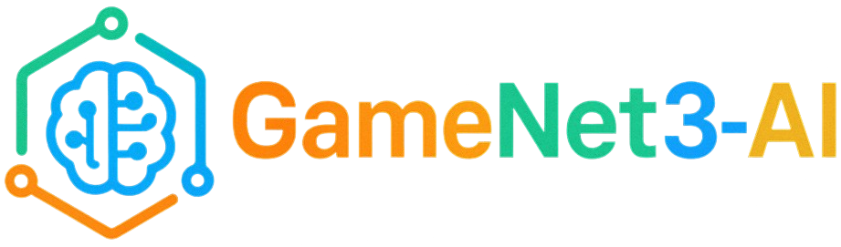

Blockchain-based decentralized social platform for gamers that includes AI-generated images for games and minting NFTs for active users.

<!-- Badges -->
[]()
[]()
[]()
[]()
[](./LICENSE.md)

## About

GameNet3-AI is a full-stack decentralized social platform built for gaming communities. It combines blockchain smart contracts, web3 integrations, a Node.js backend, and a React frontend with AI-powered features to provide secure, equitable, and accessible social experiences. The platform prioritizes user sovereignty, content provenance, and transparent moderation tools.

## Highlights

- Sovereign identities using Web3 wallets (MetaMask) without email and password
- Free AI-generated NFTs for most active users
- On-chain NFT contracts (see [`blockchain/contracts`](./blockchain/contracts))
- Web3-enabled frontend using `ethers.js` and MetaMask.
- Node.js + SQLite backend with REST APIs.
- AI utilities for chat, moderation, and personalized recommendations.

## Features

- Decentralized user identities and NFTs
- Social feed with provenance metadata
- Game listings and participation tracking
- Secure web3 integrations and transactions
- AI-driven chat and content tools

## Tech Stack

- Solidity (Hardhat) — smart contracts for NFTs and platform logic
- Node.js (Express) — backend API server in [`backend/`](./backend/)
- SQLite — local dev database at [`backend/data/dev.db`](./backend/data/dev.db)
- React + Vite — frontend in [`frontend/`](./frontend/)
- IPFS (optional) — for storing media assets
- Ethers.js / web3 utilities — in [`frontend/src/utils`](./frontend/src/utils) and [`backend/src/utils`](./backend/src/utils)

## Repository layout (truncated)

- [`blockchain/`](./blockchain/) — solidity contracts, Hardhat config, scripts, tests
- [`backend/`](./backend/) — server, routes, scripts, tests
- [`frontend/`](./frontend/) — React app, components, pages
- [`local-ipfs/`](./local-ipfs/) — local IPFS node and data

## Quick start

Prerequisites: Node.js (>=16), npm, and MetaMask (for frontend web3 interactions).

1) Start a local blockchain (Hardhat node)

```bash
# in /blockchain
npm install
npx hardhat node
```

2) Deploy contracts (in new terminal)

```bash
# in /blockchain
node scripts/deploy.js
```

3) Backend

```bash
# in /backend
npm install
# create local users and seed data
node scripts/create-local-users.js
node scripts/fetch-games.js
# start server
npm start
```

4) Frontend

```bash
# in /frontend
npm install
npm run dev
```

Open `http://localhost:3000` (or the port shown by Vite) and connect a Web3 wallet.

## Development notes

- Tests: see `blockchain/test` and `backend/test` for Mocha/Jest tests. Run them with `npm test` in each folder.
- Scripts: `backend/scripts` contains helpers for seeding, cleaning, and AI testing.
- AI: backend AI utilities are in `backend/src/utils/ai.js` and `backend/src/utils/ipfs_upload.js`.

## Contributing

We welcome contributions. Please open issues.
